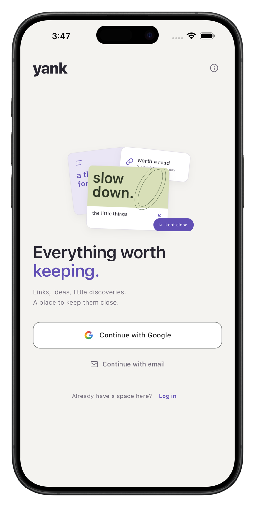
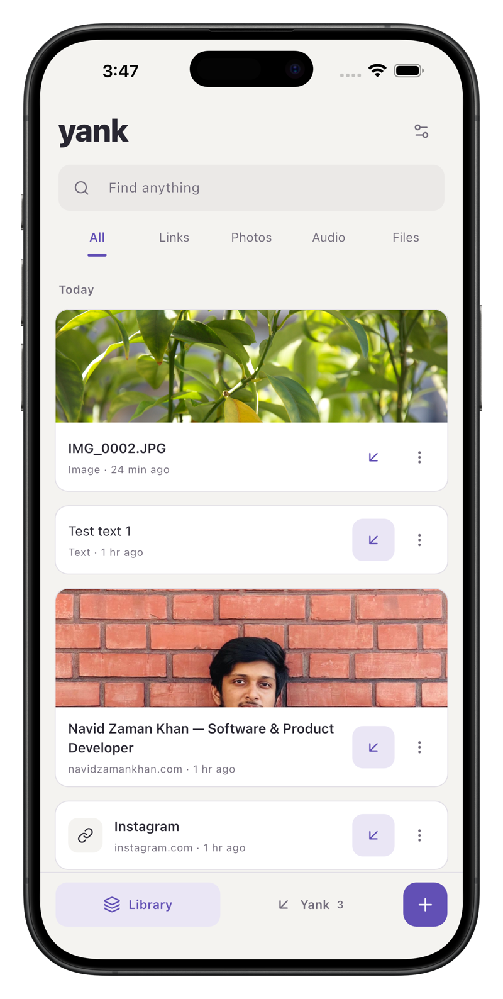
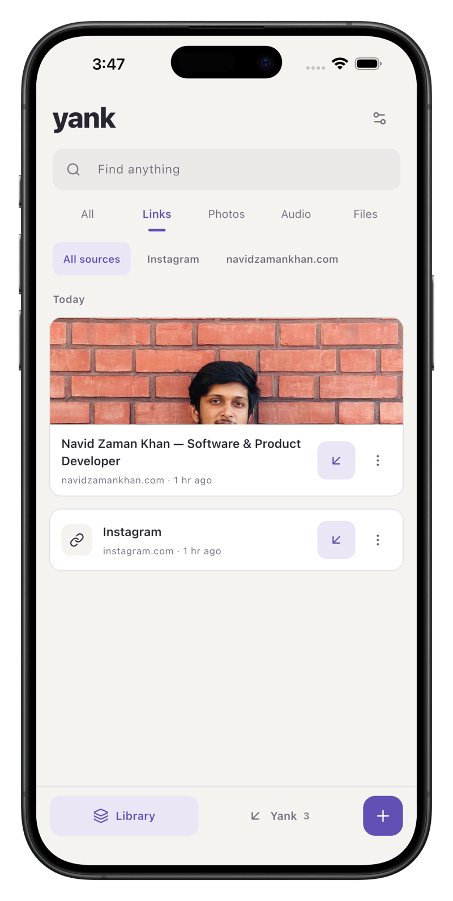
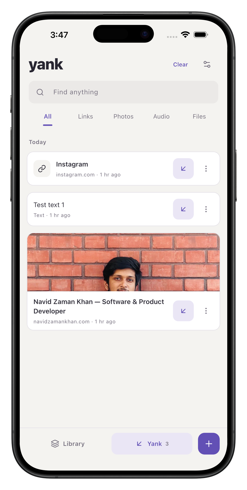
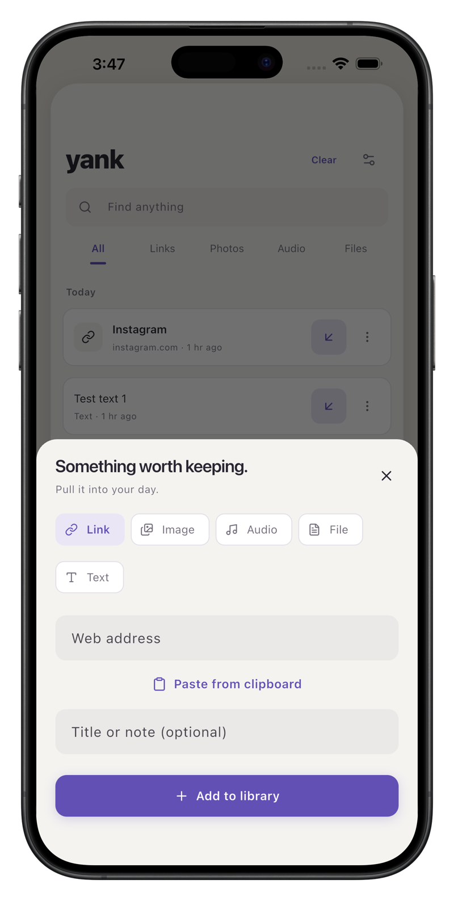
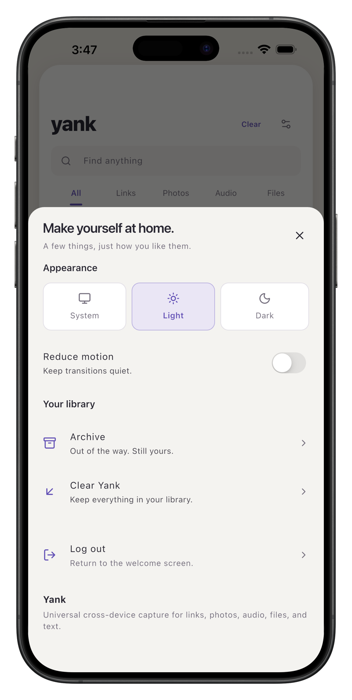

# Yank Mobile (Flutter)

Universal cross-device capture for links, photos, audio, files, and text.

## Overview

Yank is a personal capture inbox engineered for seamless multi-format capturing across iOS, Android, and macOS. The application provides an instant capture pipeline for thoughts, web links, snapshots, voice memos, and documents, organizing them into a unified chronological feed.

Designed around an offline-first architecture with local SQLite/Preferences caching and Firebase synchronization, Yank operates strictly within a $0 infrastructure budget. Global library ordering is canonical and chronological, while an independent semantic working set ("Yank") allows users to pin and organize items for current focus without modifying the underlying archive.

## App Features Showcase

### 1. Capture and Content Discovery

<table>
  <thead>
    <tr>
      <th width="33.33%" align="center">Universal Access</th>
      <th width="33.33%" align="center">Unified Inbox</th>
      <th width="33.33%" align="center">Filtered Discovery</th>
    </tr>
  </thead>
  <tbody>
    <tr>
      <td width="33.33%" align="center" valign="top">
        
      </td>
      <td width="33.33%" align="center" valign="top">
        
      </td>
      <td width="33.33%" align="center" valign="top">
        
      </td>
    </tr>
    <tr>
      <td align="center" valign="top">
        <b>Authentication Flow</b><br>
        Clean sign-in with Google or Email, keeping sessions secure across devices.
      </td>
      <td align="center" valign="top">
        <b>Unified Library</b><br>
        Chronological capture feed displaying images, rich link previews, text, and files.
      </td>
      <td align="center" valign="top">
        <b>Filtered Views</b><br>
        Fast multi-criteria filtering by media format and specific domain origins.
      </td>
    </tr>
  </tbody>
</table>

### 2. Workflow and System Preferences

<table>
  <thead>
    <tr>
      <th width="33.33%" align="center">Active Working Set</th>
      <th width="33.33%" align="center">Universal Capture Modal</th>
      <th width="33.33%" align="center">Preferences and Controls</th>
    </tr>
  </thead>
  <tbody>
    <tr>
      <td width="33.33%" align="center" valign="top">
        
      </td>
      <td width="33.33%" align="center" valign="top">
        
      </td>
      <td width="33.33%" align="center" valign="top">
        
      </td>
    </tr>
    <tr>
      <td align="center" valign="top">
        <b>Yank Scratchpad</b><br>
        Dedicated semantic working set for active tasks without altering global library order.
      </td>
      <td align="center" valign="top">
        <b>Instant Capture</b><br>
        Streamlined capture sheet with multi-type selector and one-tap clipboard paste.
      </td>
      <td align="center" valign="top">
        <b>System Customization</b><br>
        Dynamic light/dark theme switching, motion reduction, and local archive management.
      </td>
    </tr>
  </tbody>
</table>

## Core Capabilities

- Universal Multi-Format Ingestion: Capture links, high-resolution photos, audio recordings, documents, and plain notes.
- Offline-First Architecture: Immediate local persistence ensures capturing is always responsive, even without network connectivity.
- Two-Tier Organization: Distinction between the account library (canonical timeline) and the device cache (LRU lifecycle managed).
- Working Set Mechanics: Yank and Unyank items to maintain an active scratchpad without mutating the global archive.
- Zero-Cost Cloud Synchronization: Cloud Firestore and chunked transfer pipelines operating within free tier allocations.
- System Integration: Native iOS Share Extension and Android Send Intent receivers for sharing directly from any external app.

## Architecture and Directory Structure

Yank follows the BLoC (Business Logic Component) architectural pattern with unidirectional data flow and clean separation of concerns:

```
yank/
|-- android/                  # Native Android configuration and intents
|-- ios/                      # Native iOS project and Share Extension
|-- macos/                    # macOS desktop support
|-- assets/                   # App icons, audio triggers, and branding assets
|-- mockups/                  # Application showcase screenshots
|-- lib/
|   |-- app/                  # Application bootstrap and session gates
|   |-- core/
|   |   |-- motion/           # Spring animations and transition tokens
|   |   |-- theme/            # Color palettes and typography definitions
|   |   |-- utils/            # Path resolvers and local storage helpers
|   |   \-- widgets/          # Shared atomic controls and button primitives
|   |-- features/
|   |   |-- auth/             # Authentication BLoC, forms, and repositories
|   |   |-- capture/          # Capture sheet, background sync, share receivers
|   |   |-- library/          # Library BLoC, card widgets, poster artworks
|   |   |-- preview/          # Fullscreen viewers and media detail dialogs
|   |   \-- settings/         # Appearance, preferences, and cache management
|   |-- firebase_options.dart # Platform-specific Firebase configurations
|   \-- main.dart             # Application entry point
|-- test/                     # Automated unit, widget, and lifecycle tests
\-- pubspec.yaml              # Project manifest and package dependencies
```

## Technology Stack

- Framework: Flutter 3.x with Dart 3.x
- State Management: flutter_bloc and bloc (strict Event -> Bloc -> State flow)
- Backend Infrastructure: Firebase Authentication, Cloud Firestore (offline-enabled streams), Cloud Storage for Firebase
- Native Platform Interfaces: receive_sharing_intent, image_picker, file_picker, audioplayers
- Icons and Typography: Lucide Icons (lucide_icons_flutter) with custom system typography

## Getting Started

### Prerequisites

- Flutter SDK (version 3.13.3 or higher)
- Xcode (for iOS and macOS development)
- Android Studio / Android SDK (for Android development)
- CocoaPods

### Installation and Run

1. Clone the repository:
   ```bash
   git clone https://github.com/NavidZamanKhan/Yank.git
   cd Yank
   ```

2. Install dependencies:
   ```bash
   flutter pub get
   ```

3. Run the development build:
   ```bash
   flutter run
   ```

## Quality Assurance and Verification

All critical state flows, binary chunk sync mechanics, and widget alignments are backed by automated tests:

```bash
# Execute headless automated test suite
flutter test

# Run static analysis
dart analyze
```

## License

This project is distributed under the MIT License. See [LICENSE](LICENSE) for details.
